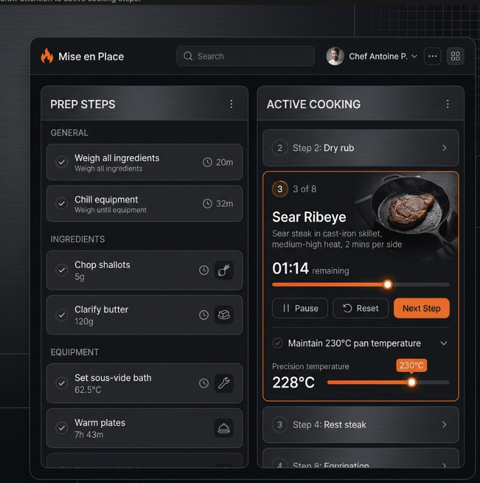

# Design Theme & UI Guidelines: Modular Recipe System

## 1. Overall Aesthetic & Vibe
**The "Modern Chef / High-End Kitchen"**
This is a sleek, premium dark mode aesthetic. It uses deep charcoals with a vibrant, energetic accent color (like stove-flame orange) to draw attention to active cooking steps. The design emphasizes precision without feeling overly clinical.

## 2. Color Palette
* **Primary Background:** Deep Charcoal and True Black (e.g., `#121212`, `#1E1E1E`). Helps reduce screen glare in bright kitchens.
* **Text Color:** High contrast soft white/light grey (`#E0E0E0`) for primary readability; muted grey (`#9E9E9E`) for secondary data.
* **Accent Color:** "Stove-Flame" Orange (`#FF6D00`) or Electric Blue. Used strictly to highlight active steps, active timers, and interactive sliders.
* **Warning/Alert Colors:** Vibrant Red (`#FF3B30`) for "Ratio Mismatch" warnings and critical callouts.

## 3. Typography
* **Headings:** Modern, geometric sans-serif (e.g., Inter, Roboto, or SF Pro) for a clean, sharp look.
* **Body Text:** Highly readable sans-serif, optimized for quick scanning from a distance.
* **Numbers & Fractions:** Monospaced (or tabular numerals) are **mandatory** for precision metrics (e.g., `12.55 g`, `03:45`) so that values align perfectly vertically and convey a sense of exactness.

## 4. UI Components & Elements
* **Dashboard Layout:** Clean two-column separation of Prep vs. Cook blocks on large screens.
* **Cards & Blocks:** Component blocks are visually separated by sleek, rounded dark cards with subtle borders (`#333333`) and slight elevation.
* **Checkboxes:** Custom styled to blend with the dark theme. Native bright white browser checkboxes are strictly forbidden. They must be sleek, dark squares that illuminate with the Accent Color when checked.
* **Badges & Tags:** 
  * Warning tags (like "Critical") must use a vibrant, high-contrast red background with a subtle glow so they pop against the charcoal background. They **must be rendered inline** alongside the step text.
  * "Optional" tags must be styled as prominent badges (e.g., using amber/warning colors with a slight border) and placed inline with the ingredient name, mirroring the design language of the Critical badge.
  * **Step Modifiers (Time & Heat):** Duration timers and heat indicators must also be rendered **inline** seamlessly alongside the step text, rather than stacked below it, to preserve vertical space and maintain a clean reading flow.
* **Tolerance Sliders:** High-visibility gradients (e.g., transitioning from dark to Stove-Flame Orange) with an illuminated "thumb" to indicate spice/sweetness levels.
* **Timers:** Neon/glowing circular or horizontal progress bars that draw the eye.

## 5. Dark Mode vs. Light Mode
* **Default:** Dark Mode native. The application is built specifically for Dark Mode to provide that premium, professional kitchen feel.
